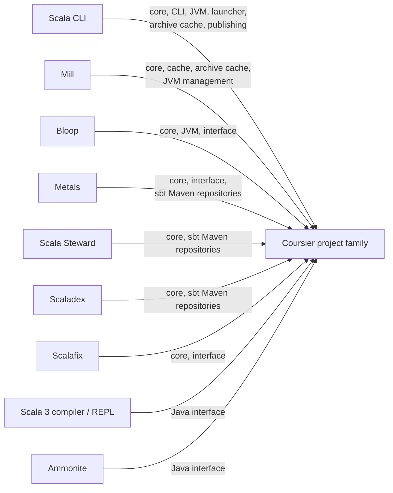

# Direct Coursier dependents in critical Scala infrastructure

This is a curated graph of direct production dependencies on the Coursier project family. It excludes sbt, test-only usage, CI actions, and tools that merely run on sbt.

## Sources

- [Scala CLI](https://github.com/VirtusLab/scala-cli/blob/main/project/deps/package.mill)
- [Mill](https://github.com/com-lihaoyi/mill/blob/main/mill-build/src/millbuild/Deps.scala)
- [Bloop](https://github.com/scalacenter/bloop/blob/main/project/Dependencies.scala)
- [Metals](https://github.com/scalameta/metals/blob/main/build.sbt)
- [Scala Steward](https://github.com/scala-steward-org/scala-steward/blob/main/project/Dependencies.scala)
- [Scaladex](https://github.com/scalacenter/scaladex/blob/main/build.sbt)
- [Scalafix](https://github.com/scalacenter/scalafix/blob/main/project/Dependencies.scala)
- [Scala 3](https://github.com/scala/scala3/blob/main/project/Dependencies.scala)
- [Ammonite](https://github.com/com-lihaoyi/Ammonite/blob/main/build.mill)

“Coursier” is split across multiple coordinates, including `coursier`, `coursier-cache`, `coursier-jvm`, `coursier-sbt-maven-repository`, and `interface`. Querying only `coursier_2.13` would therefore miss immediate dependents.
