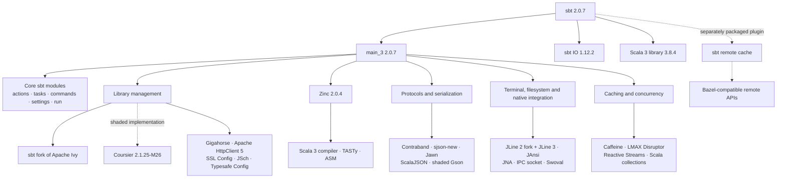

# sbt 2.0.7 dependency graph

Collapsed from the deps.dev Maven graph for `org.scala-sbt:sbt:2.0.7`, which contains 82 artifacts and 270 dependency edges.

Solid edges represent the collapsed published runtime graph. Dashed edges identify shaded, build-time, or separately packaged components discovered from the source build.

Sources:

- [deps.dev dependency graph](https://deps.dev/maven/org.scala-sbt%3Asbt/2.0.7/dependencies)
- [deps.dev API documentation](https://docs.deps.dev/api/v3alpha/)
- [sbt technology-stack documentation](/Users/anatolii/Projects/sbt/contributing-docs/07_tech_stack.md)
- [sbt dependency declarations](/Users/anatolii/Projects/sbt/project/Dependencies.scala)
